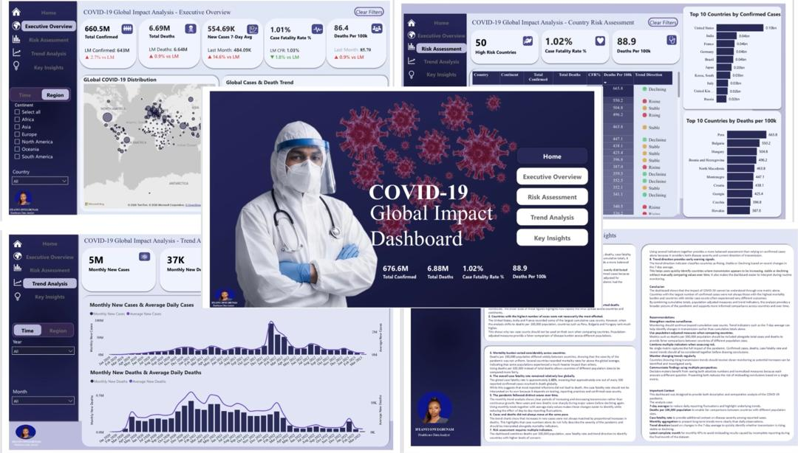
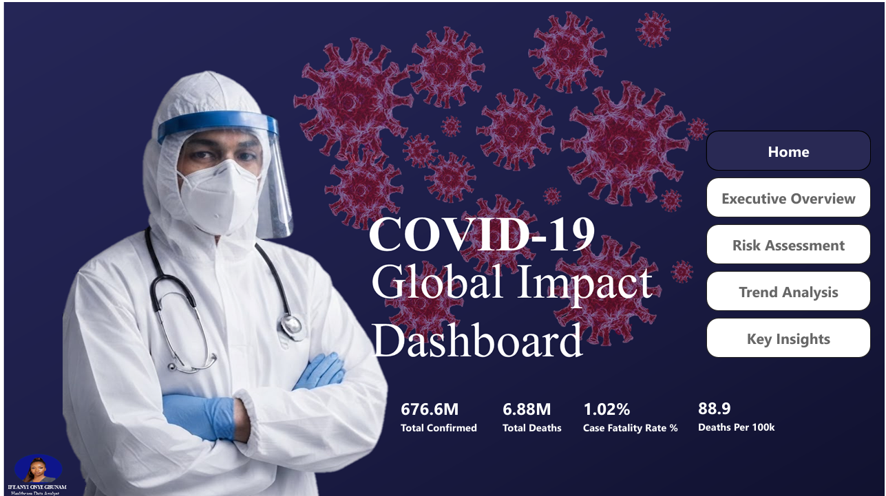
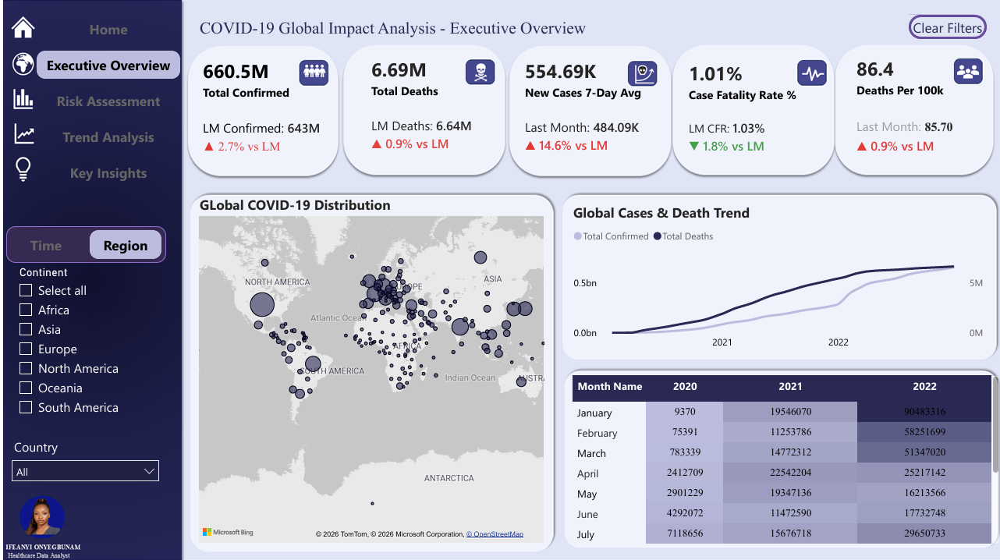
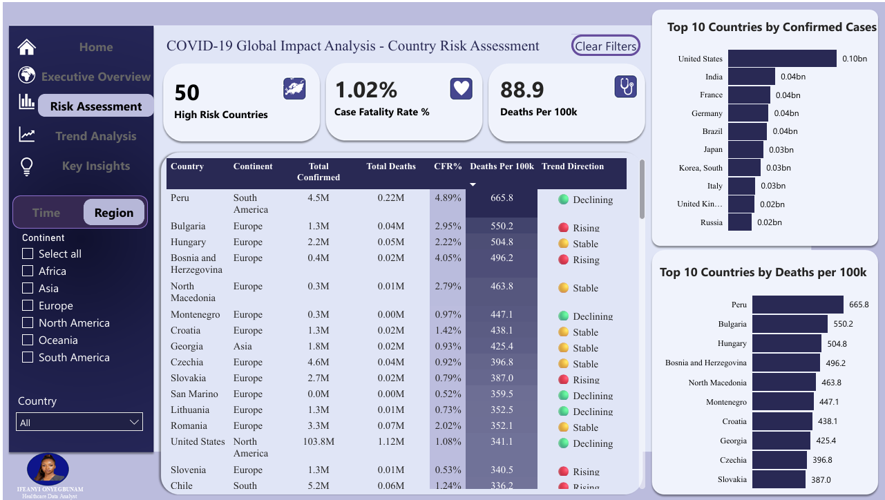
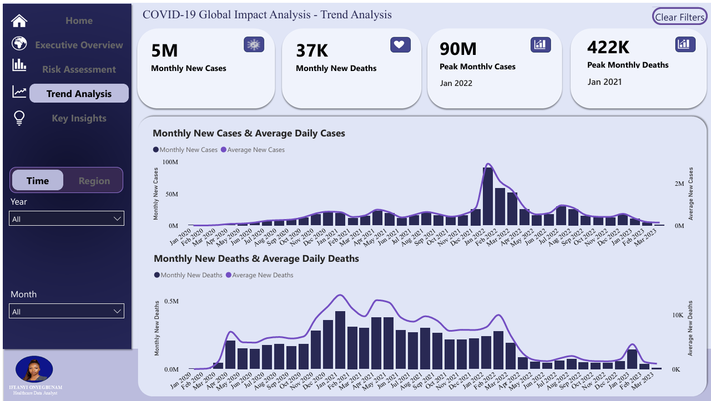
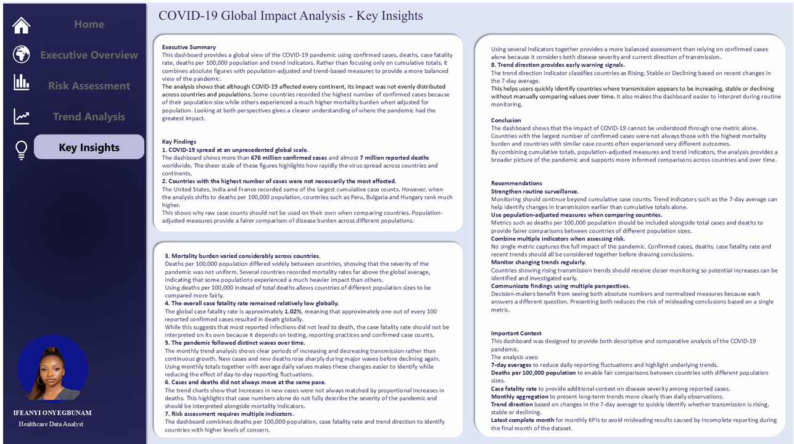

# 🌍 COVID-19 Global Dashboard | Power BI




---

# Project Overview

Data is only useful when it helps people make better decisions.

COVID-19 generated millions of records across countries and over time, making it difficult to understand the pandemic by looking at raw numbers alone. While cumulative confirmed cases provide an overall picture, they do not fully explain how severely different countries were affected or how transmission changed throughout the pandemic.

This project explores global COVID-19 data through an interactive Power BI dashboard designed to move beyond simple totals. By combining cumulative metrics, population-adjusted measures and trend indicators, the dashboard provides a more balanced view of the pandemic and supports meaningful comparisons across countries and time.

Rather than asking **"Which country recorded the most cases?"**, this project also explores questions such as:

- Which countries experienced the greatest mortality burden?
- Did countries with the highest cases also experience the highest death rates?
- How did the pandemic evolve over time?
- Which countries showed rising or declining transmission?
- Which metrics provide fairer comparisons between countries of different population sizes?

This dashboard was developed as part of the **Week 4 Power BI Project** during the **AnalystLab Africa Data Analytics Internship**.

---

# Business Problem

Public health dashboards often rely heavily on cumulative confirmed cases and total deaths.

While these metrics are useful, they can sometimes produce misleading conclusions when countries with very different population sizes are compared directly.

For example, a country with millions of confirmed cases may not necessarily have experienced the highest mortality burden once population size is considered.

Decision-makers require dashboards that provide context rather than simply presenting large numbers.

This project addresses that challenge by combining multiple analytical perspectives including cumulative totals, deaths per 100,000 population, case fatality rate and transmission trends to support more balanced decision making.

---

# Project Objectives

The primary objectives of this dashboard were to:

- Analyse the global impact of COVID-19 using interactive visualisations.
- Compare countries using both absolute and population-adjusted metrics.
- Identify countries experiencing higher mortality burden.
- Monitor changes in transmission over time.
- Present key findings through an intuitive and interactive dashboard.
- Demonstrate analytical thinking through meaningful KPI selection rather than relying solely on visual design.

---

# Tools Used

- Microsoft Power BI
- Power Query
- DAX (Data Analysis Expressions)
- Microsoft Excel

---

# Skills Demonstrated

Throughout this project, I applied several data analytics skills including:

- Data Cleaning
- Data Transformation
- Data Modelling
- DAX Measure Development
- Time Intelligence
- KPI Design
- Interactive Dashboard Design
- Trend Analysis
- Data Storytelling
- Public Health Analytics
- Data Visualization Best Practices

---

# Dataset

**Source**

Our World in Data (OWID) COVID-19 Dataset

The dataset contains global COVID-19 statistics reported across countries throughout the pandemic, including:

- Confirmed Cases
- Deaths
- Population
- Dates
- Geographic Information

Additional calculated measures were created within Power BI to support analytical comparisons.

---

# Dashboard Structure

The dashboard consists of **five interactive pages**, each designed to answer a different analytical question.

---

# 🏠 Page 1 — Home



The Home page serves as the landing page of the dashboard.

Rather than overwhelming users with multiple visuals immediately, it provides a clean introduction to the project through a healthcare-themed landing page, navigation buttons and high-level KPI cards.

This page allows users to navigate quickly to different sections of the dashboard while presenting a concise snapshot of the pandemic.

Key features include:

- Interactive navigation buttons
- Dashboard introduction
- Global KPI summary
- Reset Slicer button for easier navigation

---

# 📊 Page 2 — Executive Overview



The Executive Overview provides a high-level summary of the global pandemic.

Instead of focusing on a single metric, this page combines multiple KPIs to provide a balanced overview of COVID-19.

Displayed KPIs include:

- Total Confirmed Cases
- Total Deaths
- Case Fatality Rate
- Deaths per 100,000 Population
- Monthly New Cases
- Monthly New Deaths

Supporting visuals provide additional context by summarising how cases and deaths were distributed across continents and over time.

The goal of this page is to answer one simple question:

> **What happened globally?**

# ⚠️ Page 3 — Risk Assessment



The Risk Assessment page shifts the focus from overall pandemic statistics to identifying countries that experienced a greater public health burden.

Rather than relying solely on confirmed cases, this page combines multiple indicators to provide a more balanced assessment of risk.

Key metrics include:

- High Risk Countries
- Deaths per 100,000 Population
- Case Fatality Rate

Supporting visuals highlight:

- Top 10 Countries by Deaths per 100,000 Population
- Top 10 Countries by Case Fatality Rate
- Trend Direction by Country

This approach provides a broader understanding of how different countries were affected instead of focusing only on cumulative case counts.

### Why this matters

Countries with the highest number of confirmed cases were not always the countries that experienced the highest mortality burden.

Using population-adjusted metrics allows countries of different population sizes to be compared more fairly while reducing bias introduced by large populations.

The Trend Direction indicator further strengthens the analysis by showing whether transmission is currently increasing, stable or declining.

Together, these indicators provide a more complete assessment than relying on a single metric.

---

# 📈 Page 4 — Trend Analysis



The Trend Analysis page explores how the pandemic evolved throughout the reporting period.

Rather than presenting cumulative totals alone, this page focuses on changes over time to reveal major waves of infection and mortality.

Key KPIs include:

- Monthly New Cases
- Monthly New Deaths
- Peak Monthly Cases
- Peak Monthly Deaths

Supporting visuals display monthly trends for:

- Confirmed Cases
- Deaths

This allows users to observe periods of rapid growth, decline and stabilization throughout the pandemic.

### Why monthly analysis?

Daily COVID-19 reporting often contains fluctuations caused by reporting delays, weekends and data corrections.

Aggregating the data monthly produces smoother trends that make long-term changes easier to understand.

The dashboard also reports KPIs using the **latest complete month** rather than the final month in the dataset.

This prevents incomplete reporting from creating misleading comparisons.

---

# 💡 Page 5 — Key Insights



The final page brings together the major findings from the analysis.

Instead of introducing new visuals, this page focuses on communicating the story behind the data.

It summarizes:

- Executive Summary
- Key Insights
- Conclusion
- Recommendations
- Important Context

The purpose of this page is to translate analytical findings into clear, actionable observations that can be understood by both technical and non-technical audiences.

---

# Analytical Decisions

Building this dashboard involved more than selecting charts and writing DAX measures.

Several analytical decisions were made to improve the accuracy and reliability of the findings.

## 1. Latest Complete Month

The dataset ends in March 2023.

However, March only contains records up to the ninth day of the month.

Using this incomplete month for KPI reporting would artificially reduce monthly totals and create the false impression that cases and deaths had declined sharply.

To avoid this, all monthly KPI cards display values from the latest **complete** month available in the dataset.

This provides a more accurate comparison across reporting periods.

---

## 2. Population-adjusted comparison

Countries vary significantly in population size.

Comparing total deaths alone can produce misleading conclusions because larger countries naturally record higher cumulative counts.

Deaths per 100,000 population were included to normalize comparisons across countries and better reflect mortality burden.

This allows smaller and larger countries to be evaluated using the same scale.

---

## 3. Multiple indicators instead of a single metric

No single metric fully explains the impact of COVID-19.

For this reason, the dashboard combines:

- Confirmed Cases
- Total Deaths
- Deaths per 100,000 Population
- Case Fatality Rate
- Trend Direction

Using several indicators together provides a broader understanding of disease burden than relying on confirmed cases alone.

---

## 4. Trend Direction

The dashboard includes a Trend Direction indicator that classifies countries as:

- Rising
- Stable
- Declining

This provides a quick summary of recent transmission patterns without requiring users to manually compare trend lines across multiple countries.

---

## 5. Dashboard Design

The dashboard was designed with usability in mind.

Design choices focused on reducing visual clutter while maintaining enough detail to support analytical decision-making.

Features include:

- Consistent colour palette across all pages.
- Interactive navigation buttons.
- Reset Slicer button for easier exploration.
- KPI cards positioned to provide immediate context before detailed visuals.
- Consistent formatting across pages to improve readability.


# Executive Summary

This dashboard provides a global view of the COVID-19 pandemic using confirmed cases, deaths, case fatality rate, deaths per 100,000 population and transmission trends.

Rather than relying solely on cumulative totals, the analysis combines absolute figures with population-adjusted and trend-based measures to provide a more balanced understanding of the pandemic.

The dashboard demonstrates that although COVID-19 affected every continent, the severity of its impact varied considerably across countries. Some countries recorded the highest number of confirmed cases because of their population size while others experienced a much greater mortality burden when population was taken into account.

Looking at multiple indicators together provides a clearer understanding of where the pandemic had the greatest impact.

---

# Key Insights

The analysis revealed several important findings.

## COVID-19 spread at an unprecedented global scale.

The dashboard reports more than **676 million confirmed cases** and almost **7 million reported deaths** worldwide, highlighting the enormous scale of the pandemic across countries and continents.

---

## Total cases alone do not tell the full story.

Countries such as the United States, India and France recorded some of the largest cumulative case counts.

However, when deaths were adjusted for population size, countries including Peru, Bulgaria and Hungary ranked much higher.

This demonstrates why population-adjusted metrics are essential for fair comparisons between countries.

---

## Mortality burden varied considerably.

Deaths per 100,000 population differed substantially across countries, showing that the pandemic affected populations very differently.

Using population-adjusted measures provides better insight than comparing cumulative deaths alone.

---

## The global case fatality rate remained relatively low.

The dashboard reports a global case fatality rate of approximately **1.02%**.

Although most reported infections did not result in death globally, this metric should always be interpreted alongside testing practices and reporting quality.

---

## COVID-19 occurred in distinct waves.

Monthly trend analysis revealed several periods of rapid growth followed by declines rather than continuous transmission.

Viewing data monthly makes these long-term patterns easier to identify.

---

## Cases and deaths did not always increase together.

The dashboard shows that increases in confirmed cases were not always matched by proportional increases in deaths.

This highlights why multiple indicators should be considered together when assessing disease severity.

---

## Trend indicators improve monitoring.

Classifying countries as Rising, Stable or Declining makes it easier to identify locations where transmission is changing without manually analysing multiple trend charts.

---

# Recommendations

Based on the findings from this analysis:

- Continue monitoring transmission using trend indicators rather than cumulative totals alone.
- Compare countries using population-adjusted measures alongside absolute counts.
- Combine multiple indicators before drawing public health conclusions.
- Monitor countries showing rising transmission trends more closely.
- Present both absolute and normalized metrics to support balanced decision-making.

---

# Project Limitations

Although the dashboard provides meaningful insights, several limitations should be considered.

### Reporting quality

COVID-19 reporting varied between countries due to differences in testing capacity, reporting standards and healthcare infrastructure.

As a result, confirmed cases and deaths may not fully represent the true burden of the pandemic.

---

### Underreporting

Some countries may have experienced underreporting because of limited testing or incomplete reporting systems.

Consequently, comparisons should be interpreted with appropriate caution.

---

### Population estimates

Deaths per 100,000 population rely on available population estimates.

Changes in population over time are not reflected within this analysis.

---

### Dataset scope

The dashboard is limited to the information available within the dataset and does not include variables such as:

- Vaccination rates
- Hospitalizations
- ICU admissions
- Government intervention measures
- Healthcare capacity

Including these variables could provide additional context for interpreting country-level outcomes.

---

# Future Improvements

Several enhancements could further strengthen this project.

Future versions may include:

- Automated dataset refresh
- Vaccination analysis
- Hospitalization metrics
- Forecasting models
- WHO regional analysis
- Drill-through pages for individual countries
- Mobile-optimized dashboard layout

---

# Repository Structure

```text
COVID19-Global-Dashboard/
│
├── Dashboard/
│   ├── COVID19 Dashboard.pbix
│   ├── COVID19 Dashboard.pdf
│
├── Images/
│   ├── home-page.png
│   ├── executive-overview.png
│   ├── risk-assessment.png
│   ├── trend-analysis.png
│   └── key-insights.png
│
├── Dataset/
│   └── owid-covid-data.csv
│
└── README.md
```

---

# How to Use

1. Download the repository.
2. Open the `.pbix` file using Microsoft Power BI Desktop.
3. Navigate through each page using the built-in navigation buttons.
4. Use the available slicers to filter the dashboard.
5. Use the **Reset Slicer** button to return all filters to their default state.

---

# Skills Demonstrated

This project demonstrates practical experience in:

- Data Cleaning
- Data Modelling
- Data Transformation
- DAX
- Power Query
- Power BI Dashboard Design
- Time Intelligence
- Interactive Reporting
- KPI Design
- Data Visualization
- Trend Analysis
- Public Health Analytics
- Data Storytelling

---

# About Me

Hi, I'm **Ifeanyi Onyegbunam**.

I'm a Data Analyst and AI Automation Specialist with a healthcare background. I enjoy transforming raw data into meaningful insights and building dashboards that help people make informed decisions.

I'm particularly interested in healthcare analytics, business intelligence and workflow automation.

---
<h2 align="center">Connect With Me</h2>

<p align="center">
  <a href="https://linkedin.com/in/ifeanyi-nwamaka">LinkedIn</a> •
  <a href="https://x.com/datababyifynix">X (Twitter)</a>
</p>

## If you found this project helpful, consider giving it a ⭐
